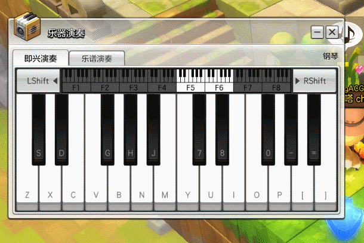

# ? 在冒险岛2中弹奏乐曲！

这是一个简单的[AutoHotKey](https://autohotkey.com/)脚本，可以将MIDI设备的输入转换为键盘操作。

使用该脚本后你便可以在冒险岛2的即兴演奏窗口中使用MIDI键盘作为输入源了。



## HOW TO USE?

```shell
AutoHotkeyU64.exe main.ahk
```

**NOTE: 请勿直接使用AutoHotKey快捷方式打开，务必选择正确的AHK可执行文件版本并以管理员权限执行**

启动后在托盘图标中选择对应的MIDI设备，即可激活键盘映射。

## Q&A

1. 为什么我用不了？

   请确保使用管理员权限启动和使用了正确的AHK宿主（比如64位操作系统必须用64位的AHK）。

2. 我只有两个八度可以用吗？

   是的，这个脚本只映射了两个八度。如果跨越多个八度可能需要模拟Shift按键操作，我很懒，你自己看着改吧。

3. 这样搞卡吗？

   当然卡了，这毕竟是个游戏不是你家DAW。目测时延在300ms~500ms，所以真要拿来弹，请考虑使用自带音源的电钢琴以规避时延问题。

4. 那这个东西有锤子用？

   可以用来装逼。

5. 那么我可以用这个东西来打字吗？

   可以，如果你喜欢的话。 

## SEE ALSO

https://github.com/dannywarren/AutoHotkey-Midi

## LICENSE

Do What The Fuck You Want To Public License